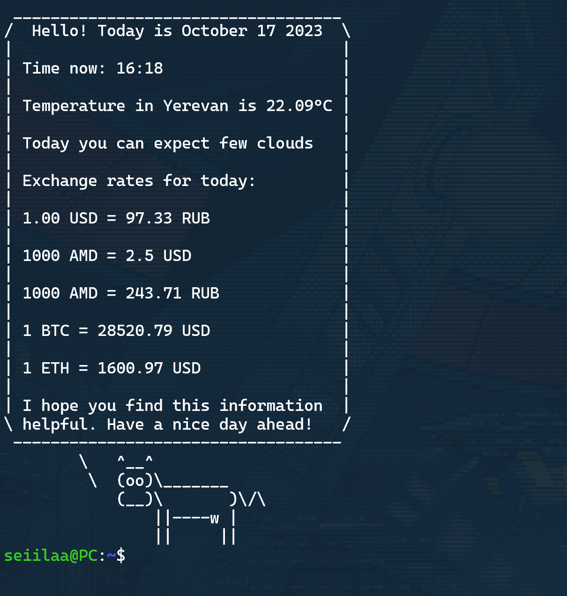

# Daily Terminal Dashboard 

It's a Python program designed to provide users with a quick overview of essential daily information directly within their terminal. 
Upon execution, the program fetches and displays the current date, local weather conditions, and relevant currency exchange rates.

## Current date and time 
The program begins by displaying current time in a user-friendly format.

## Weather Information
The program retrieves local weather inclduing a brief description using openweatherapi.
## Currency Exchange Rates
The program retrieves real-time currency exchange rates from a currencyapi. Includes cryptocurrencies.
